# LaTeX to SIXEL

[Sixel](https://en.wikipedia.org/wiki/Sixel) graphics is well suited to display images  on terminals (emulation) like [Mintty](https://mintty.github.io/) (Cygwin), [mlterm](http://mlterm.sourceforge.net/) or [Xterm](http://invisible-island.net/xterm/). Thanks to Hayaki Saito's [libsixel](http://saitoha.github.io/libsixel/), we can easily convert almost any format to sixel sequences (e.g. [img2sixel](http://saitoha.github.io/libsixel/#img2sixel)). 

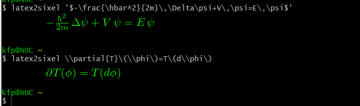

## latex2sixel
This simple shell script converts **(La)TeX** chunks to sixel output by the following composition of tools:
```
  latex [dvi] --> dvipng [png] --> img2sixel  
```
Therefore, the requirements to render LaTex chunks to a sixel graphics capable console/terminal are as follows:

* LaTeX distribution 
* dvipng (usually already included)
* libsixel (see [Install](http://saitoha.github.io/libsixel/#install))
* Sixel capable terminal

```
$ latex2sixel

This is latex2sixel V 1.0.2 (Mon Apr 11 15:59:19 CEST 2022)

Usage: ./latex2sixel [OPTION]... TEXSTRING
Options are chosen to be similar to dvips' options where possible:

  -D #         Output resolution
  -O c         Image offset
  -T c         Image size (also accepts '-T bbox' and '-T tight')
  -t	       Remove margins (shorthand for '-T tight')

  -bg s        Background color (TeX-style color or 'Transparent')
  -fg s        Foreground color (TeX-style color)

  # = number   s = string
  c = comma-separated dimension pair (e.g., 3.2in,-32.1cm)

  TEXSTRING is a LaTeX expression betweeen apostrophes (not quotes).
  Examples: '$\alpha$' | '\LaTeX' | 'This is math: $x+y$'.

Required applications: latex, dvipng, img2sixel.
Terminals supporting sixel graphics: xterm -ti vt340, mintty, mlterm.
More info @  https://github.com/saitoha/libsixel


```

The script is just a skeleton and may be adjusted to your needs. 

#### Installation
Just copy the file(s) in the `script` directory to a folder in the path,
e.g. `/usr/local/bin` or `.local/bin`.

#### Examples
```
latex2sixel '$-\frac{\hbar^2}{2m}\,\Delta\psi+V\,\psi=E\,\psi$'
latex2sixel \\partial{T}\(\\phi\)=T\(d\\phi\)
latex2sixel '$$\int_{\partial\Omega}\omega=\int_\Omega\,d\omega$$'
latex2sixel '\LaTeX\ is\ cool :)'

latex2sixel '$$\sum_{j=0}^N q^j=\frac{q^{N+1}-1}{q-1}$$'
latex2sixel '$$\forall x\in\mathbb{Z},\exists y\in\mathbb{Z}:x+y=0$$'
```

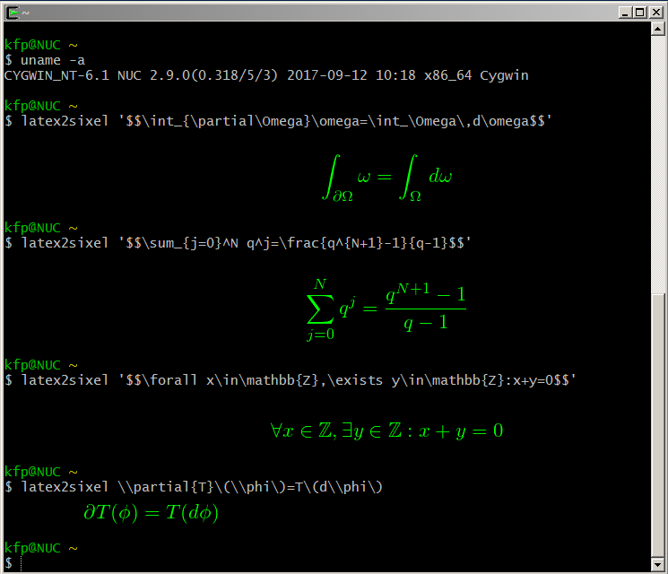

More complicated latex fragments can be stored in a file and passed to
latex2sixel as stdin. (Example: [protocol.ltx](samples/protocol.ltx).)

```bash
echo '\Large\LaTeX' | latex2sixel
latex2sixel < protocol.ltx
latex2sixel '\Large' < protocol.ltx
latex2sixel -fg Dandelion '\LARGE' < protocol.ltx
```

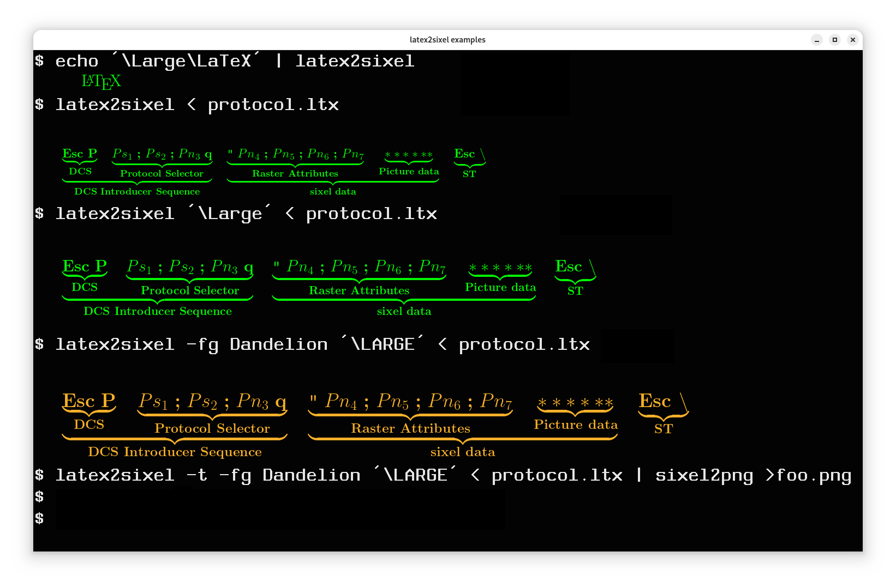


## Applications

A lot of mathematical software is able to produce **TeX** output, e.g. computer algebra systems ([CAS](https://en.wikipedia.org/wiki/Computer_algebra_system)) like FriCAS (Axiom), Maxima, Reduce, Sage, Sympy and a lot more. Many OO languages like Python or Pure have the capability to render the objects by a special representation field.  
Certain applications, however, need a special treatment, that is for instance a preamble or macro definitions which should be prepended to the input. The script `fricas2sixel` is such an example. When we define the function
```
sixel(x:TexFormat):Void ==
  cmd:=concat ["system fricas2sixel -bg Black -D 150 -fg Orange '",tex(x).1,"'"]
  systemCommand(cmd)
```
we can render almost any expression as its LaTex representation in the console:

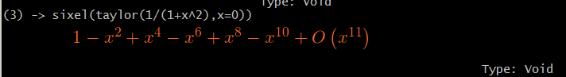

The function can be included into the startup file (`.fricas.input`), then the usage is: `sixel expression`.

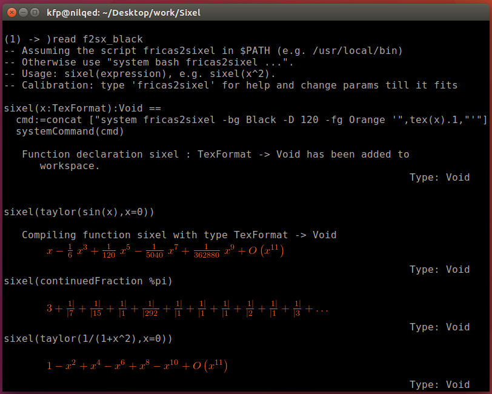

Another example is [Pure](https://agraef.github.io/pure-lang/):

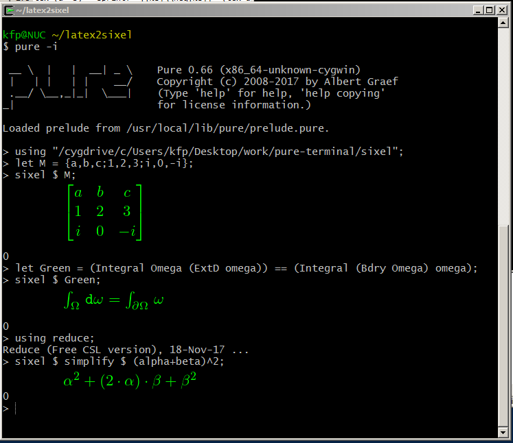

For details consult the sample file `sixel.pure` in the `sample`folder.

## GnuPlot
[GnuPlot](http://gnuplot.info/) is a portable command-line driven graphing utility for 
Linux, OS/2, MS Windows, OSX, VMS, and many other platforms. It can produce **sixel**
output. It also provides an easy mean to check if your terminal is capable to display
sixel output: `gnuplot> test`

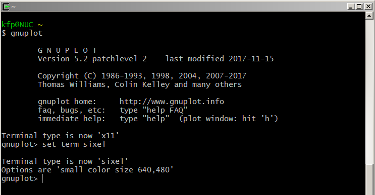

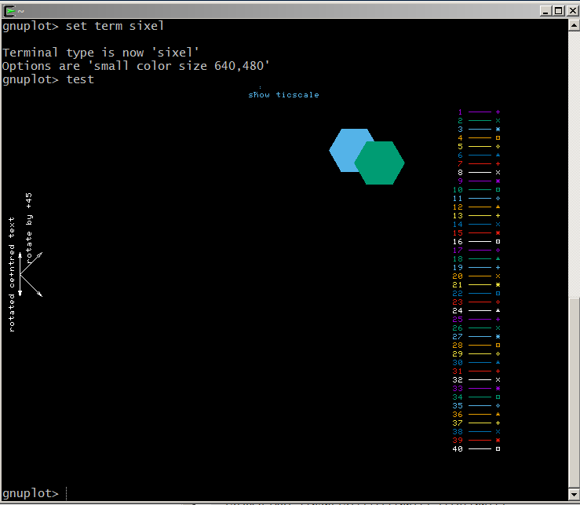

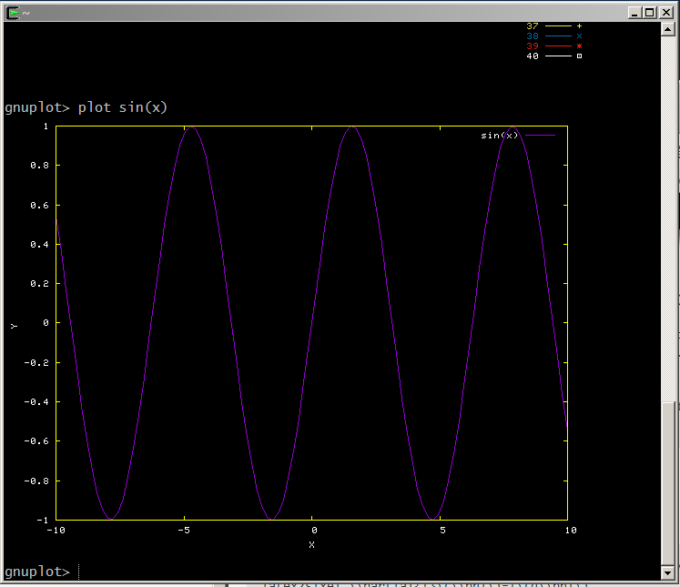

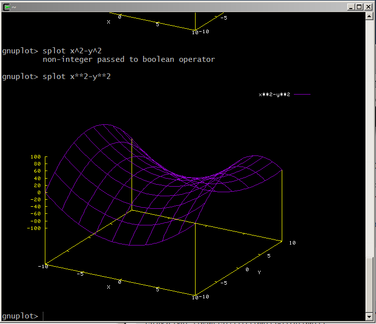

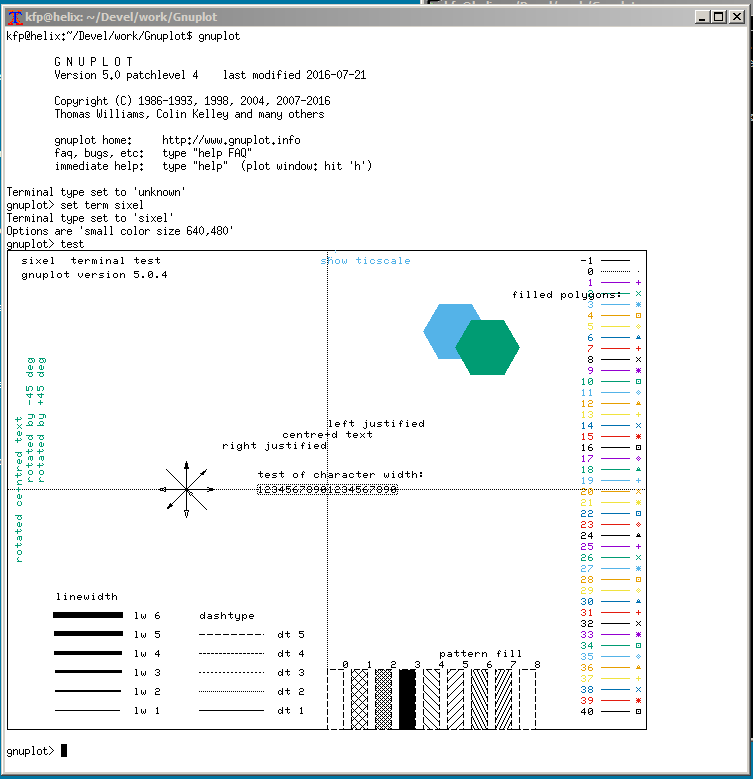

#### Calibration

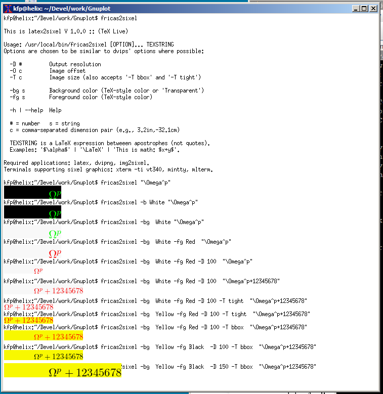

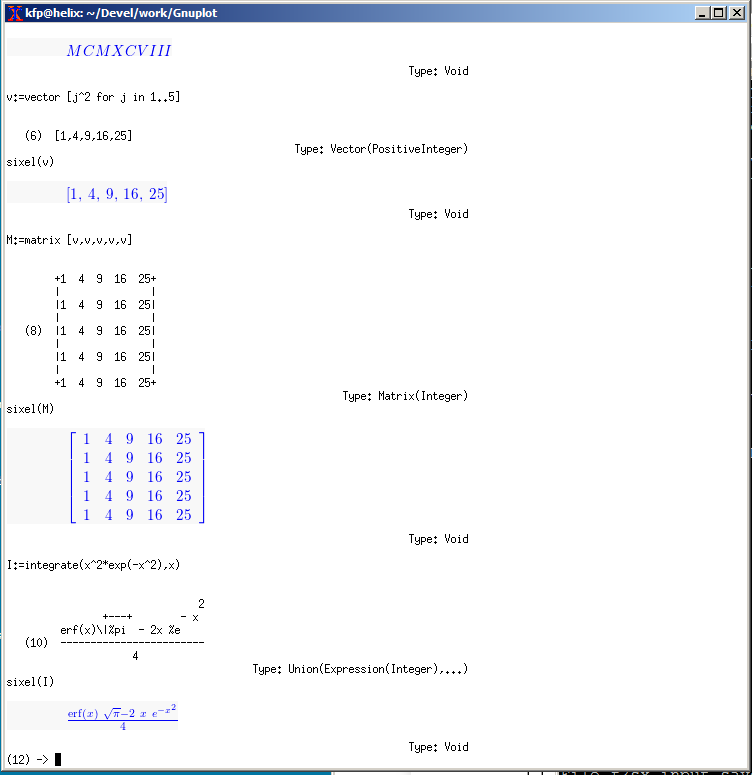

---

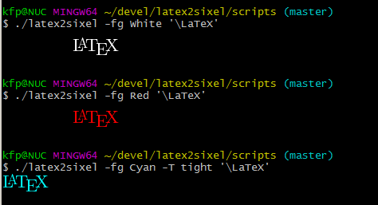

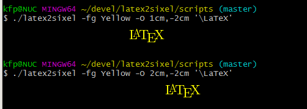

